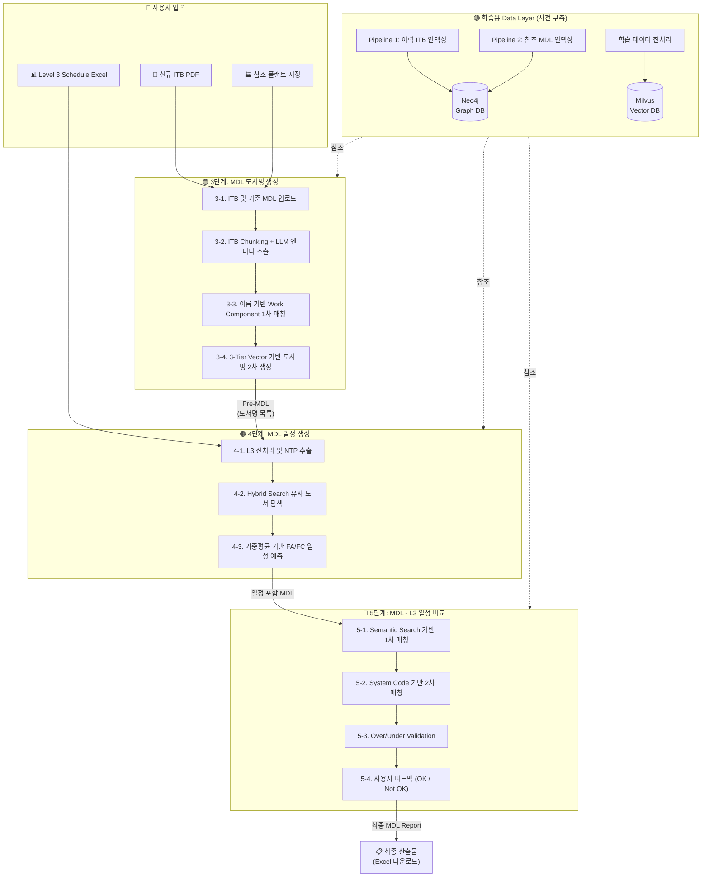
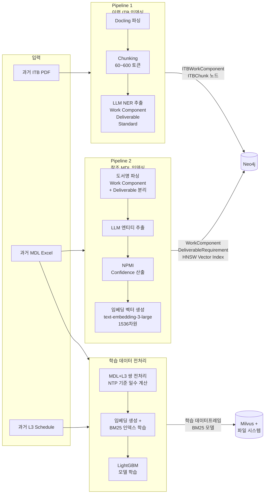
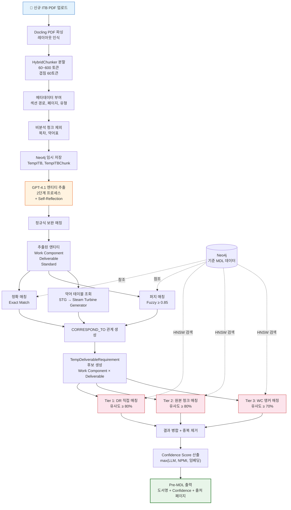
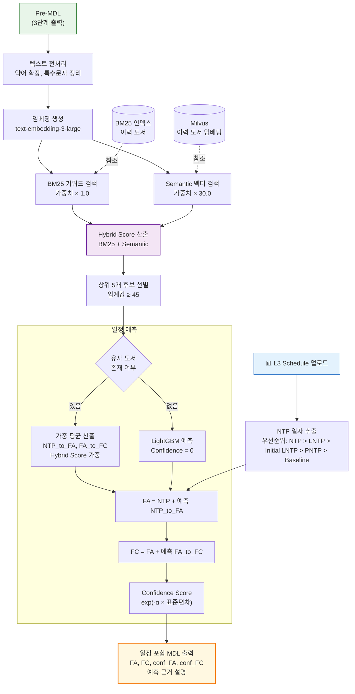
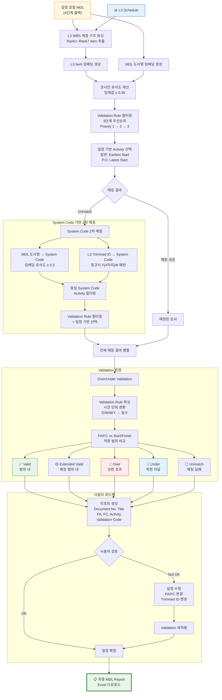
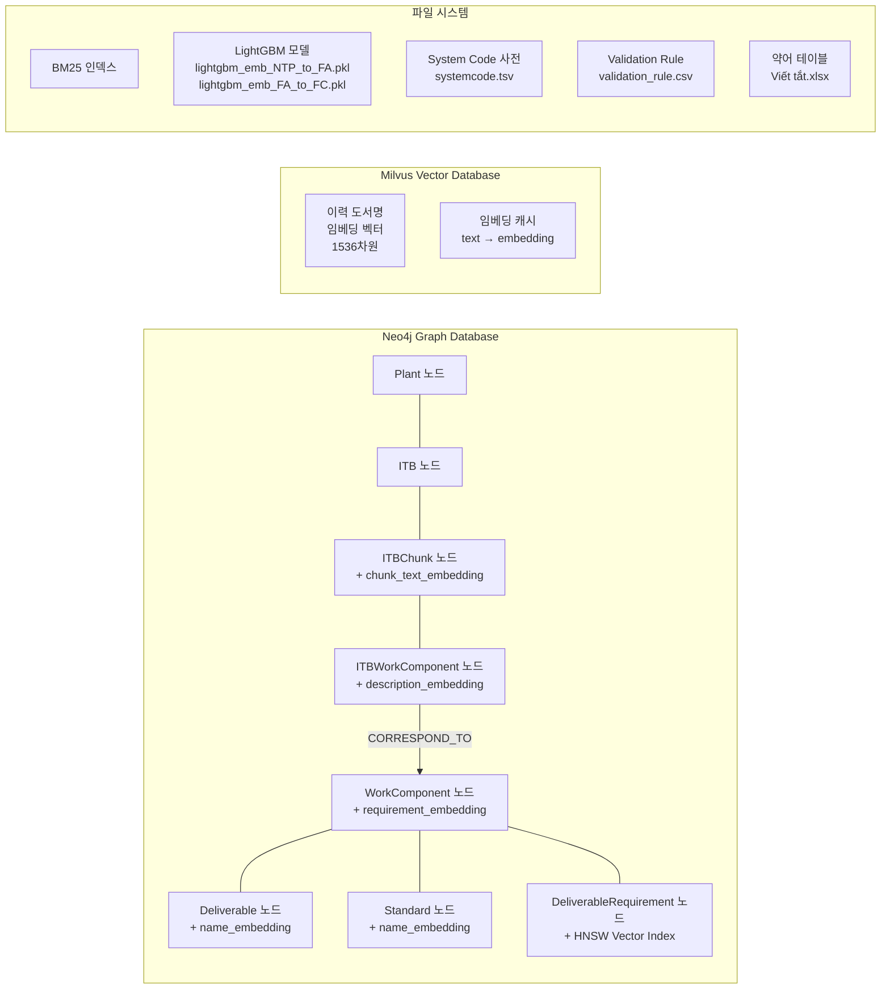

# Master Document List 시스템 전체 흐름도

## 1. 전체 파이프라인 개요

---

## 2. 학습용 Data Layer 구축 흐름

---

## 3. MDL 도서명 생성 상세 흐름 (3단계)

---

## 4. MDL 일정 생성 상세 흐름 (4단계)

---

## 5. MDL - L3 일정 비교 상세 흐름 (5단계)

---

## 6. 데이터 저장소 구성도

