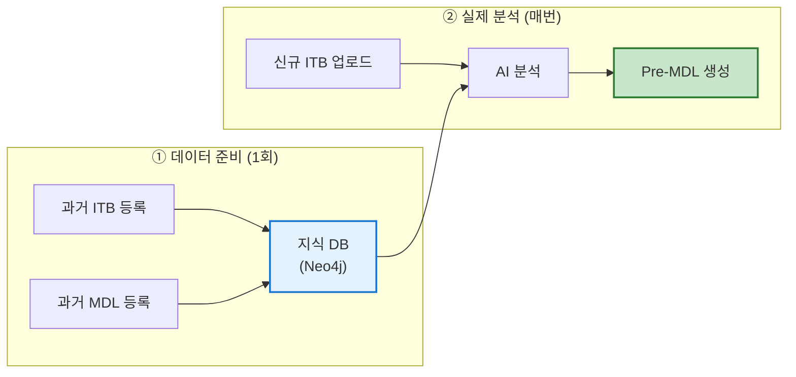

# MDL 시스템 전체 플로우 가이드

> 이 문서는 MDL(Master Document List) 자동 생성 시스템의 전체 흐름을 설명합니다.
> 개발 전문 용어는 최소화하되, 시스템의 동작 원리를 정확히 이해할 수 있도록 작성했습니다.

---

## 1. 시스템이 해결하는 문제

### 기존 문제
플랜트 건설 프로젝트를 수주하면, 발주처가 보내는 **ITB(Invitation To Bid)** 문서를 분석하여 해당 프로젝트에 필요한 **도서 리스트(MDL)**를 만들어야 합니다.

기존에는 엔지니어가 수백 페이지의 ITB를 직접 읽고, 과거 유사 프로젝트의 MDL을 참고하여 새 MDL을 수작업으로 만들었습니다. 이 과정은 **시간이 오래 걸리고**, 담당자의 경험에 따라 **누락이 발생**하기 쉽습니다.

### 시스템의 해결 방식
이 시스템은 **AI가 ITB를 읽고, 과거 프로젝트 데이터를 자동으로 참조하여 MDL 초안(Pre-MDL)을 생성**합니다.

```
신규 ITB 업로드  →  AI가 분석  →  과거 MDL과 매칭  →  Pre-MDL 초안 생성
                                                    (엔지니어가 검토·수정)
```

---

## 2. 핵심 용어 정리

시스템에서 사용되는 주요 용어를 먼저 정의합니다.

| 용어 | 설명 | 예시 |
|------|------|------|
| **ITB** | 발주처가 보내는 입찰 초대 문서. 프로젝트 요구사항이 서술형으로 적혀 있음 | "The HRSG shall include..." |
| **MDL** | 프로젝트에 필요한 도서(문서) 목록. 행 단위로 도서명이 나열됨 | P&ID, Technical Specification, ... |
| **Work Component (WC)** | 설비/시스템/장치 단위. 플랜트를 구성하는 구성요소 | HRSG, Steam Turbine, Pump |
| **Deliverable** | 도서의 종류/유형 | P&ID, Datasheet, Drawing |
| **DeliverableRequirement (DR)** | WC + Deliverable의 조합 = 실제 도서명 | "HRSG - P&ID", "Pump - Datasheet" |
| **참조 MDL** | 과거 유사 프로젝트의 MDL. 새 프로젝트의 MDL을 만들 때 참고 자료로 사용 | Fadhili 프로젝트 MDL |
| **Pre-MDL** | 시스템이 자동 생성한 MDL 초안. 엔지니어의 검토가 필요 | (시스템 출력물) |

### Work Component와 Deliverable의 관계

MDL의 한 행(= 도서 1건)은 기본적으로 아래 구조입니다:

```
도서명 = Work Component + Deliverable
        (무엇에 대한)       (어떤 종류의 문서)

예시:
  "HRSG - P&ID"          = HRSG(설비)        + P&ID(배관계장도)
  "Steam Turbine - 도면"  = Steam Turbine(설비) + 도면(Drawing)
  "Pump - 사양서"         = Pump(설비)         + 사양서(Specification)
```

---

## 3. 시스템의 두 가지 모드

시스템은 크게 **"데이터 준비"**와 **"실제 분석"** 두 단계로 나뉩니다.



### ① 데이터 준비 단계 (1회성)
- 과거 프로젝트의 ITB와 MDL을 시스템에 등록합니다
- 시스템이 이 데이터를 분석하여 **지식 DB(Knowledge Base)**를 구축합니다
- 이 과정은 프로젝트 데이터를 추가할 때만 수행합니다

### ② 실제 분석 단계 (매번)
- 사용자가 신규 ITB를 업로드하면 AI가 분석합니다
- 준비 단계에서 구축한 지식 DB를 참조하여 Pre-MDL을 생성합니다

---

## 4. 데이터 준비: 지식 DB 구축

### 4-1. 과거 ITB 등록 (Pipeline 1)

과거 프로젝트의 ITB 문서를 시스템에 넣으면 다음 과정을 거칩니다:

```
과거 ITB PDF
    ↓
① PDF 파싱: 문서를 읽어 텍스트로 변환
    ↓
② 청킹: 텍스트를 적절한 크기(60~600 단어)로 분할
    ↓
③ AI 엔티티 추출 (LLM 사용):
   각 청크에서 Work Component, Deliverable, Standard 등을 추출
   예) "The HRSG system shall comply with..." → WC: "HRSG"
    ↓
④ 관계 구축:
   추출된 엔티티 간의 관계를 그래프로 구성
   예) "Steam Turbine" → PART_OF → "Power Block"
    ↓
⑤ 지식 DB 저장
```

> **포인트**: 이 단계에서 시스템은 *"과거 ITB에서 어떤 설비/시스템들이 언급되었는가"*를 학습합니다.

### 4-2. 과거 MDL 등록 (Pipeline 2)

과거 프로젝트의 MDL(도서 리스트)을 시스템에 넣으면:

```
과거 MDL (Excel/CSV)
    ↓
① 도서명 파싱:
   각 행의 도서명(Comprehensive Title)을 읽음
   예) "HRSG - Piping \u0026 Instrument Diagram"
    ↓
② AI 엔티티 추출 (LLM 사용):
   도서명에서 WC와 Deliverable을 분리
   → WC: "HRSG", Deliverable: "P\u0026ID"
    ↓
③ 관계 매핑:
   이 WC가 이 Deliverable을 필요로 한다는 관계를 저장
   → "HRSG" -[REQUIRES_DELIVERABLE]→ "P\u0026ID"
    ↓
④ 유사도 벡터 생성:
   각 도서명을 숫자 벡터(임베딩)로 변환하여 유사도 검색이 가능하게 준비
    ↓
⑤ 지식 DB 저장
```

> **포인트**: 이 단계에서 시스템은 *"과거 프로젝트에서 어떤 설비에 어떤 도서가 필요했는가"*를 학습합니다.

### 4-3. 지식 DB의 구조

데이터 준비가 완료되면 지식 DB에는 다음과 같은 정보가 저장됩니다:

```
[WorkComponent: HRSG]
    ├── REQUIRES_DELIVERABLE → [DR: HRSG - P\u0026ID]
    ├── REQUIRES_DELIVERABLE → [DR: HRSG - Technical Specification]
    ├── REQUIRES_DELIVERABLE → [DR: HRSG - Datasheet]
    └── PART_OF → [WorkComponent: Power Block]

[WorkComponent: Steam Turbine]
    ├── REQUIRES_DELIVERABLE → [DR: Steam Turbine - Drawing]
    ├── REQUIRES_DELIVERABLE → [DR: Steam Turbine - Calculation]
    └── PART_OF → [WorkComponent: Power Block]
```

이 구조를 **그래프 데이터베이스(Neo4j)**에 저장합니다. 그래프 DB는 이런 "엔티티와 관계"를 표현하고 탐색하는 데 최적화된 데이터베이스입니다.

---

## 5. 실제 분석: 신규 ITB → Pre-MDL 생성

사용자가 신규 ITB를 업로드하면, 시스템은 **7단계**를 거쳐 Pre-MDL을 생성합니다.

### 전체 흐름 요약

```
신규 ITB PDF 업로드
    ↓
Step 1. PDF 파싱 + 청킹
Step 2. 청크 정보를 임시 저장
Step 3. AI가 각 청크에서 엔티티 추출 ← 유일한 LLM 사용 구간
Step 4. 추출된 엔티티를 임시 저장
Step 5. 참조 MDL의 Work Component와 이름 매칭
Step 6. 도서명 후보 임베딩 벡터 생성
Step 7. 참조 MDL과 벡터 유사도 매칭
    ↓
Pre-MDL (도서명 리스트 + 신뢰도 점수)
```

### 각 단계 상세 설명

#### Step 1~2: PDF 파싱 + 청킹

```
신규 ITB PDF (수백 페이지)
    ↓
Docling 엔진으로 파싱 (레이아웃/표/그림 인식)
    ↓
60~600 단어 단위로 청크 분할
    ↓
목차(TOC) 페이지는 자동으로 제외
    ↓
각 청크에 메타데이터 부여:
  - 어느 섹션에 속하는지 (예: "4.3 General Requirements")
  - 몇 페이지인지
  - 청크 유형 (본문/표/목록)
```

> **왜 청킹하나?** AI(LLM)에 한번에 보낼 수 있는 텍스트 양에 한계가 있고, 너무 긴 텍스트를 보내면 정확도가 떨어지기 때문에 적절한 크기로 나눕니다.

#### Step 3: AI 엔티티 추출 (LLM) ⭐

이 단계가 **유일하게 LLM(GPT-4.1)을 사용하는 구간**입니다.

```
각 청크 텍스트
    ↓
GPT-4.1에 프롬프트 전달:
  "이 텍스트에서 Work Component, Deliverable, Standard를 추출하세요"
    ↓
AI 추출 결과 예시:
  청크: "The HRSG shall include complete P\u0026ID and Technical Specification..."
  →  WC: ["HRSG"]
  →  Deliverable: ["P\u0026ID", "Technical Specification"]
  →  Standard: ["ASME Section VIII"]
  →  관계: HRSG → DESCRIBE_FOR → P\u0026ID
```

**자기 검증(Self-Reflection)** 기능이 있어, 추출 결과를 한번 검토하고 누락된 것이 있으면 보완합니다.

또한 **정규식(Regex) 매칭**도 병행합니다. LLM이 놓친 엔티티를 규칙 기반으로 추가 포착합니다.

#### Step 4~5: 엔티티 저장 + WC 이름 매칭

```
추출된 WC/Deliverable → 임시 노드로 Neo4j에 저장
    ↓
이름 매칭:
  신규 ITB에서 추출한 "HRSG" → 참조 MDL의 "HRSG"와 매칭
  (퍼지 매칭으로 약간의 오타/축약어도 인식)
  
  예) "STG" → 약어 테이블 조회 → "Steam Turbine Generator"와 매칭
    ↓
CORRESPOND_TO 관계 생성:
  [Temp WC: HRSG] → CORRESPOND_TO → [참조 MDL의 WC: HRSG]
```

> **LLM은 사용하지 않습니다.** 문자열 유사도 계산(Fuzzy Matching)과 약어 테이블(Alias Table)로 매칭합니다.

#### Step 6~7: 벡터 유사도 매칭 (3-Tier)

이 단계에서 실제로 **"어떤 도서가 필요한가?"**를 결정합니다.

```
Step 5에서 만든 (WC × Deliverable) 쌍
    ↓
임베딩 벡터로 변환 (텍스트 → 1536차원 숫자 벡터)
    ↓
참조 MDL에 있는 모든 도서명(DR)의 벡터와 유사도 비교
    ↓
유사도가 높은 순서대로 매칭
```

**3단계 매칭 전략 (Tier System)**:

| Tier | 전략 | 유사도 기준 | 설명 |
|:---:|------|:---:|------|
| **1** | DR 직접 매칭 | ≥ 80% | 신규 ITB에서 추출한 "WC-Deliverable" 쌍과 참조 MDL의 도서명을 직접 비교 |
| **2** | 청크 매칭 | ≥ 80% | ITB 원문 청크 자체와 참조 MDL 도서명을 비교 (Tier 1에서 못 찾은 것 보완) |
| **3** | WC 앵커 매칭 | ≥ 70% | 같은 WC에 속한 참조 MDL의 도서를 가져옴 (Tier 1,2에서 못 찾은 것 보완) |

```
예시:
  Tier 1: "HRSG - P\u0026ID" (신규) ↔ "HRSG - P\u0026ID" (참조) → 유사도 95% ✅ 매칭
  Tier 2: 청크 "valve specification..." ↔ "Valve - Specification" (참조) → 유사도 85% ✅ 매칭
  Tier 3: WC "Pump"이 매칭됨 → 참조 MDL에서 Pump의 도서 전체를 후보로 추가
```

> **LLM은 사용하지 않습니다.** 임베딩(텍스트를 벡터로 변환)은 별도의 임베딩 모델(text-embedding-3-large)이 처리하고, 유사도 비교는 수학적 계산(코사인 유사도)으로 수행합니다.

---

## 6. 출력: Pre-MDL

최종 결과물은 **Pre-MDL**로, 각 도서에 대해 다음 정보가 포함됩니다:

| 항목 | 설명 | 예시 |
|------|------|------|
| **도서명** | WC + Deliverable 조합 | HRSG - P\u0026ID |
| **Work Component** | 관련 설비 | HRSG |
| **Deliverable** | 도서 유형 | P\u0026ID |
| **신뢰도 (Confidence)** | 매칭 정확도 (0~100%) | 92% |
| **신뢰도 출처** | 어떤 방식으로 매칭하였는지 | Tier 1 / Tier 2 / Tier 3 |
| **출처 페이지** | ITB의 어느 페이지에서 발견되었는지 | p.23, p.45 |
| **분야 (Discipline)** | 엔지니어링 분야 | Mechanical / Electrical |

---

## 7. 신뢰도(Confidence Score)란?

시스템이 "이 도서가 정말 필요하다"고 얼마나 확신하는지를 나타내는 점수입니다.

### 신뢰도 결정 방식

3가지 소스에서 산출되며, 가장 높은 값을 최종 신뢰도로 사용합니다:

| 소스 | 의미 | 산출 방법 |
|------|------|----------|
| **LLM 신뢰도** | AI가 ITB에서 직접 발견한 근거의 강도 | LLM이 추출 시 함께 출력 |
| **매트릭스 신뢰도** | 과거 데이터에서 해당 WC-Deliverable 조합이 함께 등장한 빈도 | 통계 기반 (NPMI 공식) |
| **임베딩 신뢰도** | 벡터 유사도 점수 | 코사인 유사도 |

```
최종 신뢰도 = max(LLM 신뢰도, 매트릭스 신뢰도, 임베딩 신뢰도)
```

**신뢰도가 높을수록** → 시스템이 "이 도서는 거의 확실히 필요하다"고 판단
**신뢰도가 낮을수록** → 엔지니어의 추가 검토가 필요

---

## 8. 기술 구성 요약

기획 관점에서 알아두면 좋은 기술 구성 요소입니다.

| 구성요소 | 역할 | 기획 시 고려사항 |
|---------|------|----------------|
| **GPT-4.1** (Azure OpenAI) | ITB 텍스트에서 엔티티 추출 | API 호출 비용 발생, 처리 시간에 영향 |
| **Neo4j** (그래프 DB) | WC-Deliverable 관계 저장/검색 | 과거 프로젝트 데이터가 많을수록 정확도 향상 |
| **HNSW 벡터 인덱스** | 유사도 검색 (빠른 근사 최근접 이웃 탐색) | 참조 MDL이 많을수록 매칭 후보 풀이 넓어짐 |
| **Docling** | PDF 파싱 (레이아웃 인식) | 테이블, 그림 등 복잡 레이아웃도 처리 가능 |
| **FastAPI** | 백엔드 API 서버 | 업로드/조회/내보내기 API 제공 |

### 비용과 처리 시간 참고

| 항목 | 수치 |
|------|------|
| ITB 1건 처리 시간 | 약 2~5분 (페이지 수에 따라 다름) |
| LLM API 비용 | 청크당 약 2,000 토큰 소모 |
| 참조 데이터 규모 | 약 62만 노드 (지식 DB 기준) |

---

## 9. 참조 플랜트(ref_plant) 개념

사용자가 ITB를 업로드할 때, **"어떤 과거 프로젝트와 비슷한지"**를 지정할 수 있습니다.

```
업로드 시 옵션:
  ref_plant = "Rumah \u0026 Nairyah"  → 이 플랜트의 MDL만 참조하여 매칭
  ref_plant = "global"            → 모든 과거 플랜트의 MDL을 참조하여 매칭
```

- **특정 플랜트 지정** → 매칭 정확도가 높아지지만, 검색 범위가 좁아짐
- **global** → 검색 범위가 넓어지지만, 관련 없는 매칭이 포함될 수 있음

기본값은 `"Rumah & Nairyah"`입니다.

---

## 10. 시스템의 한계와 주의사항

> [!WARNING]
> 아래 사항은 기획/운영 시 반드시 고려해야 합니다.

| 항목 | 설명 |
|------|------|
| **Pre-MDL은 초안** | 시스템 출력은 반드시 엔지니어가 검토·수정해야 합니다. 100% 자동화가 목적이 아닙니다. |
| **참조 데이터 품질** | 과거 MDL의 품질이 낮으면 매칭 정확도도 낮아집니다. "Garbage in, garbage out" |
| **새로운 설비/도서** | 과거에 없었던 새로운 종류의 설비나 도서는 시스템이 자동 발견하기 어렵습니다 |
| **LLM 비용** | 긴 ITB 문서일수록 청크 수가 많아지고, LLM API 호출 비용이 증가합니다 |
| **처리 시간** | ITB 파일 크기와 Azure API 응답 속도에 따라 처리 시간이 변동됩니다 |

---

## 부록: 자주 묻는 질문

### Q. AI가 직접 도서명을 "만들어내나요"?
**아닙니다.** AI는 ITB에서 설비명/도서명을 "추출"하고, 과거 데이터에서 유사한 도서를 "검색"합니다. **새로운 도서명을 창작하지 않습니다.** 결과는 항상 과거 MDL에 존재했던 도서명 또는 ITB에서 직접 추출된 조합입니다.

### Q. 과거 프로젝트 데이터를 추가하면 정확도가 올라가나요?
**네.** 유사한 유형의 과거 프로젝트 MDL을 많이 등록할수록, 시스템이 참조할 수 있는 도서명 풀이 넓어지고 매칭 정확도가 향상됩니다.

### Q. LLM 모델을 바꾸면 결과가 달라지나요?
**달라질 수 있습니다.** 엔티티 추출 정확도에 영향을 줍니다. 현재는 GPT-4.1을 사용하고 있으며, 프롬프트(LLM에 보내는 지시문)와 함께 튜닝되어 있습니다.

### Q. 신뢰도가 낮은 도서는 무시해도 되나요?
**아닙니다.** 신뢰도가 낮다는 것은 "시스템이 확신하지 못한다"는 의미이지, "불필요하다"는 의미가 아닙니다. 오히려 엔지니어가 **더 주의 깊게 검토해야 하는 항목**입니다.
